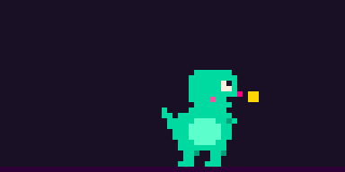

# no-ethical-consumption showcase



A pixel dino that eats my Claude tokens, grows fat on the spend, and explodes when I hit my plan limit.

This repo is the public showcase of **no-ethical-consumption** (NEC-001), a token-burn critter pet for Claude Code. The tool reads Claude Code's local session logs (token counts only, never content), prices them at API rates, and shows a dino whose size follows today's spend and whose mood follows the burn rate and the plan's 5-hour window. The tool's own repo is private for now; this one holds only the page and the web dino.

**Live page:** https://maerlined.github.io/no-ethical-consumption-showcase/

## What's here

| File | What it is |
|---|---|
| `index.html`, `showcase.js` | The showcase page |
| `nec-dino.js` | The dino as a standalone web element, `<nec-dino>` |
| `img/nec-watch.png` | Animated PNG of real frames from the terminal view (`nec --watch`) |
| `fonts/` | Self-hosted fonts (Silkscreen, Atkinson Hyperlegible, JetBrains Mono) with their SIL Open Font License texts |

## The web dino

One file, about 19 KB, no dependencies. It draws on a 64 × 32 canvas, so you size it with CSS:

```html
<script type="module" src="nec-dino.js"></script>
<nec-dino demo></nec-dino>                            <!-- loops through stages and moods -->
<nec-dino stage="chonky" mood="sweating"></nec-dino>  <!-- one state, animated -->
```

```css
nec-dino { display: block; width: 16rem; max-width: 100%; aspect-ratio: 2 / 1; }
nec-dino canvas { display: block; width: 100%; height: 100%; image-rendering: pixelated; }
```

- `stage` is one of `hatchling`, `chonky` or `absolute unit`.
- `mood` is one of `napping`, `munching`, `sweating`, `panicking` or `exploded`.

The element sets `role="img"` and an `aria-label`. It shows a still frame under `prefers-reduced-motion` and pauses while offscreen. It uses no inline styles, no network and no eval, so it works under a strict Content Security Policy. The header comment in the file has the details.

## Where it comes from

Everything here is generated in the private tool repo and copied in unchanged:

- `nec-dino.js` and `img/nec-watch.png` are generated from the same pixel sprites the terminal dino uses.
- A test there checks that the web element draws the same pixels as the terminal version.

Current content: no-ethical-consumption @eea49b3 (2026-10-07).

## Credits

- Made with Claude Code: the code and the pixel art were written by Claude, directed by Maerlin (concept, design and decisions).
- Colours from the Retro Synth Sunset kitty theme by BuckedUnicorn, adapted from the VS Code theme retro-synth-dark.
- Fonts: Silkscreen, Atkinson Hyperlegible and JetBrains Mono, under the SIL Open Font License 1.1 (licence texts in `fonts/`).

## Licence

No licence is granted for the code or the art, so please don't reuse them without asking (open an issue). The fonts keep their own licence.

*Superseded 2026-10-07:* ~~The fonts are under the SIL Open Font License 1.1 (see `fonts/`). Everything else: © Maerlin, all rights reserved for now.~~ *(Maerlin's call: credits instead of a copyright claim that may not cover AI-written parts.)*
